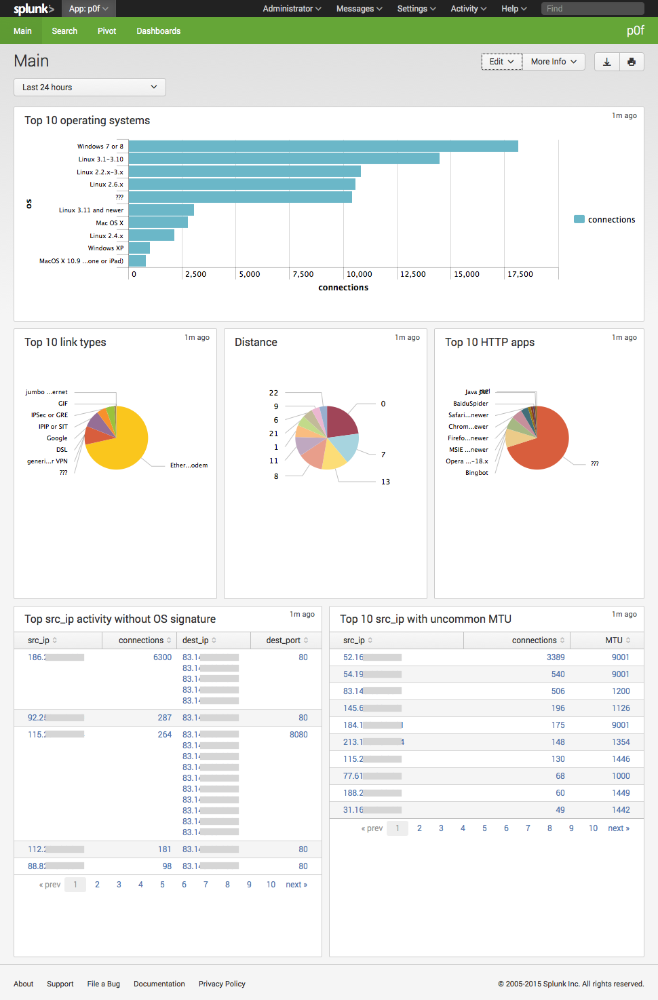

# Splunk App for p0f

This Splunk App provides search knowledge on the log file from p0f, the passive OS fingerprinting tool.
The search knowledge is captured in a single datamodel, from which various
panels are built through the Splunk pivot tool. It covers the log file from
p0f version 3.08, or any newer version that uses the same logging format as v3.08

## Installation

1. Install this Splunk TA on your indexer(s), or manually create index(es) called "p0f"
2. Install this Splunk TA on your search head to get the main p0f dashboard
3. Install this Splunk TA on your deployment server, or manually create an app with the appropriate inputs.conf

    ````
    cd $SPLUNK_HOME/etc/deployment-apps`
    git clone https://github.com/jorritfolmer/splunk_ta_p0f.git
    ````

    * Enable the inputs on the deployment server by setting `disabled = 0` in `$SPLUNK_HOME/etc/deployment-apps/splunk_ta_p0f/default/inputs.conf`
    * `/opt/splunk/bin/splunk reload deploy-server`
    * Create a serverclass (e.g. `p0f`) on the deployment-server
    * Assign this app to the serverclass
    * Assign clients the serverclass

## Configuration

None necessary, but feel free to poke around.

## Splunk data models and CIM compliance

This Splunk TA is compatible with Splunk Enterprise 6.2+.
It provides 1 data model with 8 childs:

* root
    * mtu
    * syn
    * syn+ack
    * uptime
    * http_request
    * http_response
    * host_change
    * ip_sharing

The data model provides fields compatible with the Splunk Common Information Model (CIM):

* src_ip
* src_port
* dest_ip
* dest_port
* status ("cli" for client, "srv" for server)
* os 
* vendor_product (web browsers)
* change_type (mtu, port etc changes from a single IP)

And the following non CIM-compliant field:

* p0f_lang
* p0f_params
* p0f_uptime
* p0f_raw_freq
* p0f_dist (distance in network hops)
* p0f_link (link type derived from MTU)
* p0f_mtu

## Main Dashboard




